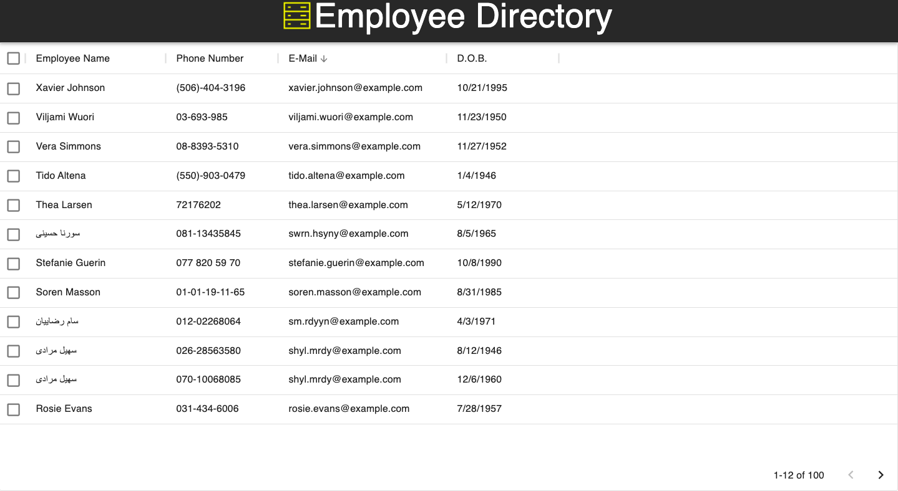

# Employee Directroy

## Description
This application allows for quick access to information inside of an employee directory by allowing the user the ablility to view the entire directory at once. 

## Usage
Please visit the deployed site by [Clicking Here](https://adamhayward.github.io/Employee_Directory/).

At the top of the table the user is provided the abliltiy to sort data by by ascending/descending; as well as provide the option to filter. 

## Licenses 
MIT

## Questions
If there are any questions realted to the application, the user is 

encouraged to vistit the creator's GitHub, at: https://github.com/adamhayward,

or to contact the developer directy via email, at: a.hayward11@gmail.com.